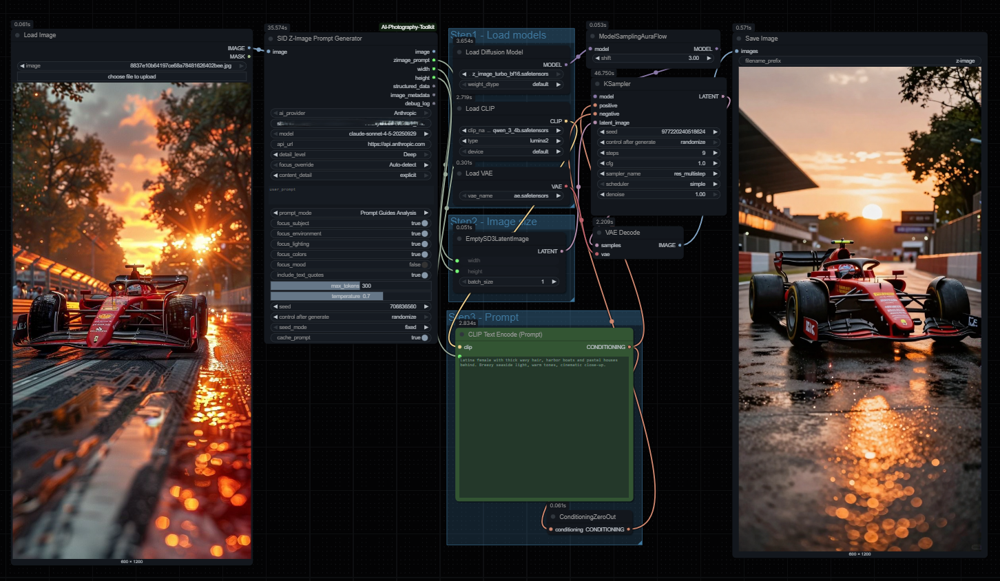

# ComfyUI-AI-Photography-Toolkit

AI-powered Z-Image prompt generator for ComfyUI. Analyzes images and generates flowing narrative prompts optimized for Z-Image models.



**Version:** 4.2.0
**Author:** Siddhartha Lahiri

## Installation

```bash
cd ComfyUI/custom_nodes
git clone https://github.com/slahiri/ComfyUI-AI-Photography-Toolkit.git
```

Restart ComfyUI. All dependencies install automatically on first load.

## Nodes (v4.2.0)

The toolkit provides **3 unified nodes**:

| Node | Description |
|------|-------------|
| **SID_LLM_API** | Cloud LLM providers (Anthropic, OpenAI, Gemini, Grok, Ollama, LM Studio, and more) |
| **SID_LLM_Local** | Local models (Florence-2, Moondream2, SmolVLM, Phi-3.5, QwenVL) |
| **SID_ZImagePromptGenerator** | Z-Image prompt generation (auto-switches Single-Shot/Agentic based on LLM) |

## Quick Start

### Basic Workflow

```
SID_LLM_API ──────────┐
  (or SID_LLM_Local)  │
                      ├─→ SID_ZImagePromptGenerator ─→ prompt
           Image ─────┘
```

### Example: Using Claude

1. Add `SID_LLM_API` node
2. Set Provider: `Anthropic`
3. Enter your API key
4. Select model: `claude-sonnet-4-5-20250929`
5. Connect to `SID_ZImagePromptGenerator`
6. Connect your image
7. Run!

## Cloud Providers (SID_LLM_API)

The unified `SID_LLM_API` node supports 15+ providers:

| Provider | API Key Required | Models |
|----------|------------------|--------|
| **Anthropic** | Yes | Claude 4.x Sonnet, Opus, Haiku |
| **OpenAI** | Yes | GPT-4o, GPT-4o-mini, o1, o3 |
| **Google Gemini** | Yes | Gemini 2.0, 1.5 Pro, Flash |
| **xAI Grok** | Yes | grok-2-vision, grok-vision-beta |
| **Mistral** | Yes | pixtral-large, pixtral-12b |
| **DeepSeek** | Yes | deepseek-chat |
| **Cohere** | Yes | command-r-plus |
| **Together AI** | Yes | Llama Vision, Qwen-VL |
| **Fireworks** | Yes | Llama, Qwen models |
| **Groq** | Yes | Llama, Mixtral |
| **Perplexity** | Yes | Sonar models |
| **Ollama** | No (local) | llava, llama3.2-vision, bakllava |
| **LM Studio** | No (local) | Any loaded model |
| **OpenRouter** | Yes | Multiple providers |
| **Custom** | Optional | Any OpenAI-compatible endpoint |

### Provider Setup Examples

#### Anthropic Claude
```
Provider: Anthropic
API Key: sk-ant-xxx (from console.anthropic.com)
Model: claude-sonnet-4-5-20250929
Enable Reasoning: On (for agentic analysis)
```

#### OpenAI GPT-4
```
Provider: OpenAI
API Key: sk-xxx (from platform.openai.com)
Model: gpt-4o
```

#### Ollama (Local)
```
Provider: Ollama
Model: llava (or llama3.2-vision)
(No API key required - runs locally)
```

#### LM Studio (Local)
```
Provider: LM Studio
Custom Model: your-loaded-model-name
(No API key required - runs locally)
```

## Local Models (SID_LLM_Local)

The `SID_LLM_Local` node runs vision models locally without API keys:

| Model | VRAM | Description |
|-------|------|-------------|
| **Florence-2 Large** | ~4GB | Microsoft's efficient vision model |
| **Moondream2** | ~4GB | Lightweight, fast inference |
| **SmolVLM** | ~4GB | Compact vision-language model |
| **Phi-3.5 Vision** | ~8GB | Microsoft's capable VLM |
| **QwenVL 2B** | ~6GB | Alibaba's vision model (best quality) |

> **Recommendation:** QwenVL currently produces the best quality prompts among local models. Use with reasoning disabled (single-shot mode) for optimal results.

### Quantization (CUDA only)
- Auto: Automatic based on VRAM
- None: Full precision (most VRAM)
- 4-bit: Lowest VRAM usage
- 8-bit: Balance of quality/VRAM

## Prompt Generator (SID_ZImagePromptGenerator)

The unified prompt generator automatically selects the best pipeline:

| Input | Options | Description |
|-------|---------|-------------|
| image | - | Source image to analyze |
| llm_model | - | Connect from SID_LLM_API or SID_LLM_Local |
| analysis_mode | Quick, Standard, Detailed, Extreme | Analysis depth |
| preset_style | Auto-Detect, Portrait, Fashion, Artistic, NSFW | Style preset |
| user_guidance | text | Optional custom instructions |
| seed | number | Reproducibility seed |

### Auto Pipeline Selection

The node automatically chooses the pipeline based on LLM capabilities:

- **Agentic Pipeline** (reasoning enabled): Multi-step analysis with comprehensive component breakdown
- **Single-Shot Pipeline** (standard): Fast, direct prompt generation

This is controlled by the `Enable Reasoning` toggle on the LLM provider nodes.

### Analysis Modes

| Mode | Components Analyzed | Use Case |
|------|---------------------|----------|
| Quick | Subject, setting | Fast previews |
| Standard | + pose, clothing, lighting | General use |
| Detailed | + all components | Quality output |
| Extreme | All + multiple passes | Maximum detail |

### Preset Styles

| Preset | Focus Areas |
|--------|-------------|
| Auto-Detect | Intelligent detection |
| Portrait | Face, expression, skin |
| Fashion & Outfit | Clothing, accessories |
| Artistic Style | Lighting, composition |
| NSFW/Detailed | Comprehensive body analysis |

## Node Settings Reference

### SID_LLM_API Settings

| Setting | Description |
|---------|-------------|
| provider | Cloud provider selection |
| api_key | Provider API key |
| model | Model selection (provider-specific) |
| custom_model | Override model name |
| custom_api_url | Custom endpoint URL |
| max_tokens_preset | Output length (Short/Medium/Long/Very Long/Maximum) |
| temperature | Creativity (0.0-2.0) |
| enable_reasoning | Enable extended thinking for agentic analysis |

### SID_LLM_Local Settings

| Setting | Description |
|---------|-------------|
| model | Local model selection |
| max_tokens_preset | Output length preset |
| temperature | Creativity (0.0-2.0) |
| quantization | 4-bit/8-bit/None/Auto |
| enable_reasoning | Enable reasoning mode (disabled by default) |

> **Note:** Local models perform better with **reasoning disabled** (single-shot mode). The agentic/reasoning mode requires structured JSON output which local Thinking models struggle with. For best results with local models like Qwen3-VL, keep `enable_reasoning` off and use the default single-shot pipeline.

## Outputs

| Output | Description |
|--------|-------------|
| prompt | Generated Z-Image narrative prompt |
| width | Image width |
| height | Image height |

## Dependencies

All dependencies **auto-install** on first load:
- `anthropic` - Claude API
- `openai` - OpenAI-compatible APIs
- `google-generativeai` - Gemini API
- `requests` - HTTP library
- `pyyaml` - Configuration
- `transformers` - Local models
- `accelerate` - GPU optimization

## Deprecated in v4.2.0

The following nodes have been **removed** and replaced with unified alternatives:

| Deprecated Node | Replacement |
|-----------------|-------------|
| `SID_ZImagePromptGenerator` (basic) | `SID_ZImagePromptGenerator` (unified) |
| `SID_ZImagePromptGenerator_Advanced` | `SID_ZImagePromptGenerator` (unified) |
| `SID_ZImagePromptGenerator_Advanced_V2` | `SID_ZImagePromptGenerator` (unified) |
| `SID_Anthropic_LLM` | `SID_LLM_API` (provider: Anthropic) |
| `SID_OpenAI_Compatible_LLM` | `SID_LLM_API` (provider: OpenAI/Custom) |
| `SID_Grok_LLM` | `SID_LLM_API` (provider: xAI Grok) |
| `SID_GGUF_LLM` | `SID_LLM_Local` |
| `SID_QwenVL_LLM` | `SID_LLM_Local` (model: QwenVL) |

### Migration Guide

**Before (v4.1.x):**
```
SID_Anthropic_LLM ─→ SID_ZImagePromptGenerator_Advanced_V2
```

**After (v4.2.0):**
```
SID_LLM_API ─→ SID_ZImagePromptGenerator
```

Simply:
1. Replace individual LLM nodes with `SID_LLM_API` or `SID_LLM_Local`
2. Replace any prompt generator with `SID_ZImagePromptGenerator`
3. Reconnect image and LLM model inputs

## Changelog

See [CHANGELOG.md](CHANGELOG.md) for full version history.

### Version 4.2.0 (Latest)
- **Unified to 3 nodes** - simplified from 8+ nodes
- **SID_LLM_API** - single node for 15+ cloud providers
- **SID_LLM_Local** - single node for 5 local models
- **SID_ZImagePromptGenerator** - unified prompt generator with auto pipeline selection
- **Auto Single-Shot/Agentic switching** based on LLM reasoning capability
- **Max tokens preset** dropdown (Short/Medium/Long/Very Long/Maximum)
- **Enable reasoning toggle** for extended thinking support

## License

MIT License
